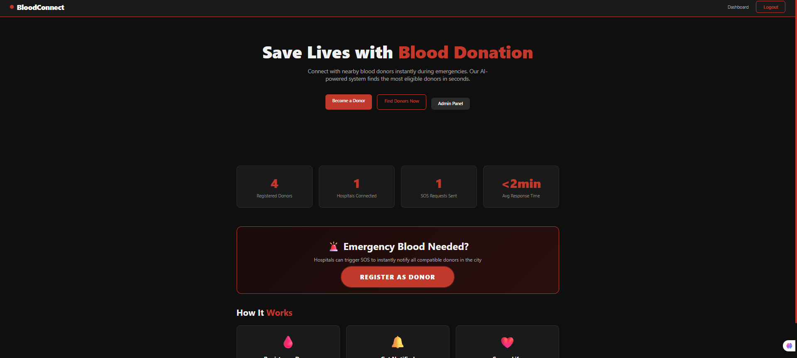
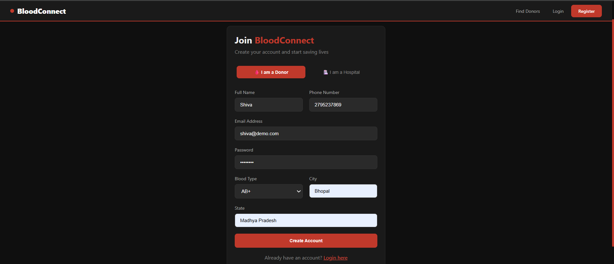
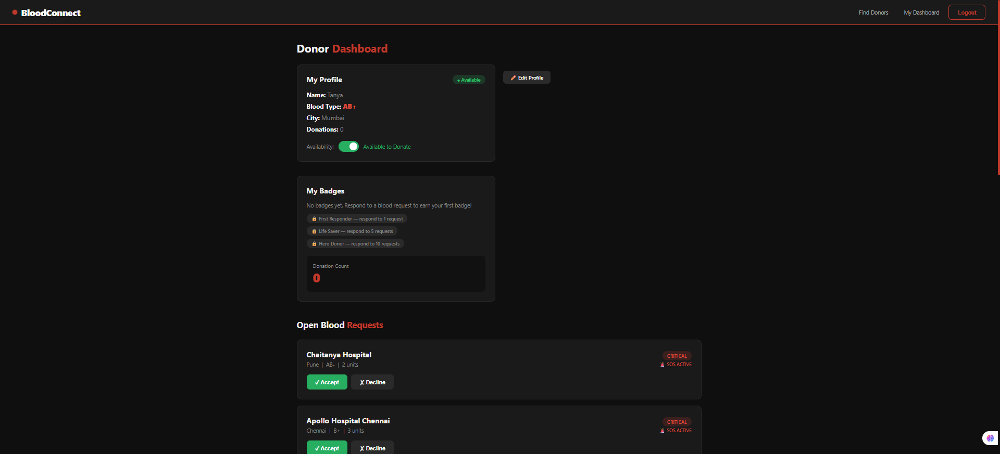
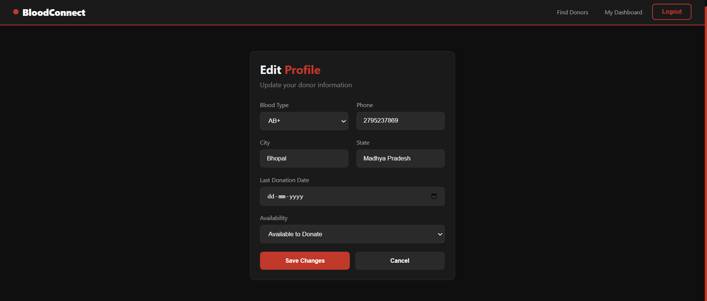
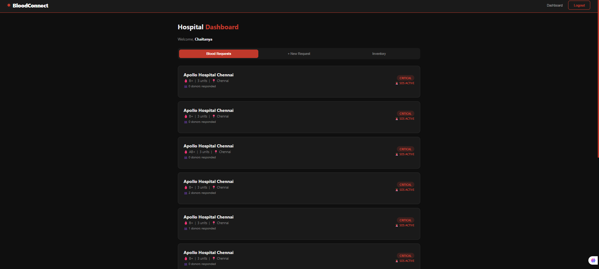
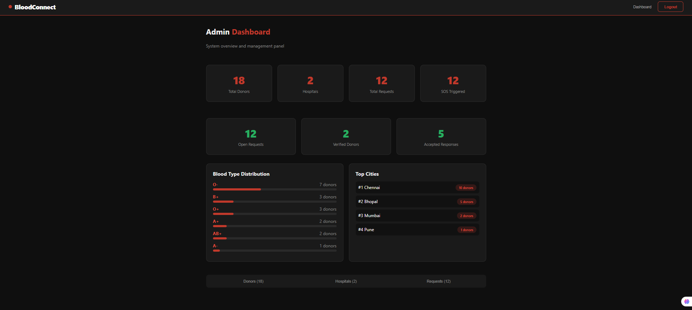

# 🩸 BloodConnect

A full-stack MERN application that connects blood donors with hospitals through an intelligent and easy-to-use platform. BloodConnect enables donor registration, hospital blood requests, donor search based on blood group and location, and role-based dashboards for donors, hospitals, and administrators.

> Built to simplify emergency blood donation and improve the speed of finding suitable donors.

---

## 🌐 Live Demo

🔗 **Live Website:** https://blood-connect-umber.vercel.app

> **Note:** The backend is hosted on Railway's free tier. If the application has been inactive, the first request may take a few seconds while the server wakes up.

---

## ✨ Features

### Donor

- Register and login securely
- Manage donor profile
- Toggle donation availability
- View donation badges
- Search nearby blood requests

### Hospital

- Hospital authentication
- Create blood requests
- View active requests
- Manage blood inventory
- Track donor responses

### Admin

- View platform analytics
- Monitor hospitals and donors
- Blood type distribution
- Request statistics
- Manage system overview

### Security

- JWT Authentication
- Role-Based Access Control (RBAC)
- Password hashing using bcrypt
- Protected API routes
- Input validation

---

## 📸 Application Screenshots

### Home Page



---

### Donor Registration



---

### Donor Dashboard



---

### Edit Profile



---

### Hospital Dashboard



---

### Admin Dashboard



---

## 🛠 Tech Stack

### Frontend

- React.js
- React Router
- Axios
- CSS

### Backend

- Node.js
- Express.js
- MongoDB
- Mongoose

### Authentication

- JWT
- bcrypt

### Deployment

- Vercel (Frontend)
- Railway (Backend)
- MongoDB Atlas (Database)

---

## 🏗 Project Architecture

```

React Frontend
│
▼
Express REST API
│
├── Authentication
├── Donor Routes
├── Hospital Routes
├── Admin Routes
└── Request Management
│
▼
MongoDB Atlas

```

---

## 📂 Project Structure

```

BloodConnect
│
├── client
│ ├── src
│ ├── components
│ ├── pages
│ ├── context
│ └── services
│
├── server
│ ├── config
│ ├── middleware
│ ├── models
│ ├── routes
│ └── server.js
│
└── README.md

```

---

## 🚀 Getting Started

### Clone the repository

```bash
git clone https://github.com/TwinkleGhodki/BloodConnect.git
```

### Install dependencies

Frontend

```bash
cd client
npm install
```

Backend

```bash
cd server
npm install
```

---

### Environment Variables

Backend (.env)

```env
PORT=5000
MONGO_URI=your_mongodb_connection
JWT_SECRET=your_secret
```

Frontend (.env)

```env
REACT_APP_API_URL=http://localhost:5000
```

---

### Run locally

Backend

```bash
npm run dev
```

Frontend

```bash
npm start
```

---

## 📡 API Endpoints

| Method | Endpoint | Description |
|----------|----------------------------|---------------------------|
| POST | /api/auth/register | Register user |
| POST | /api/auth/login | Login user |
| GET | /api/donors | Search donors |
| POST | /api/requests | Create request |
| GET | /api/requests | Get all requests |
| GET | /api/admin/stats | Admin dashboard |

---

## 📸 Screenshots

Screenshots will be added soon.

---

## 🚀 Future Improvements

- Email notifications
- SMS alerts
- Real-time request updates
- Blood donation history
- AI-based donor ranking
- Google Maps integration
- Push notifications

---

## 👨‍💻 Author

**Twinkle Ghodki**

- GitHub: https://github.com/TwinkleGhodki
- LinkedIn: https://linkedin.com/in/twinkleghodki

---

If you found this project helpful, consider giving it a ⭐ on GitHub.
